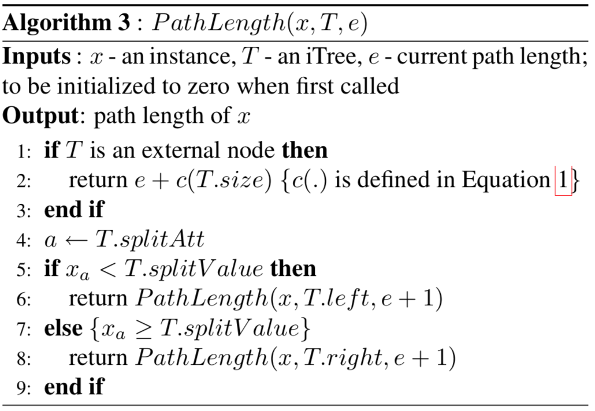

# Isolation Forest Implementation

The goal of this project is to implement the original [Isolation Forest](IsolationForestPaper.pdf) algorithm by Fei Tony Liu, Kai Ming Ting, and Zhi-Hua Zhou.  (A later version of this work is also available: [Isolation-based Anomaly Detection](http://citeseerx.ist.psu.edu/viewdoc/download?doi=10.1.1.673.5779&rep=rep1&type=pdf).) There are two general approaches to anomaly detection: 

1. model what normal looks like and then look for nonnormal observations
2. focus on the anomalies, which are few and different. This is the interesting and relatively-new approach taken by the authors of isolation forests.

The isolation forest algorithm is original and beautiful in its simplicity; and also seems to work very well, with a few known weaknesses. The academic paper is extremely readable so is the best start to know everything.

## Data sets

The datasets we use are

* [Kaggle credit card fraud competition data set](https://www.kaggle.com/mlg-ulb/creditcardfraud); download, unzip to get `creditcard.csv`

* Get cancer data into `cancer.csv` from [savecancer.csv](https://github.com/parrt/msds689/blob/master/projects/iforest/savecancer.py) .

* [http.zip](https://github.com/parrt/msds689/blob/master/projects/iforest/http.zip); download, unzip to get `http.csv`.

The code assumes the data files are in the same directory as the code.

## Visualization of normal versus anomaly separation

Using [plot_anomalies.py](https://github.com/parrt/msds689/blob/master/projects/iforest/plot_anomalies.py), you can see the results of the isolation forest trying to detect anomalies. These data sets all have known targets indicating normal versus anomaly, but this information is only used during testing and not during training. In other words, we use this information to discover how well we can separate the distribution of normal versus anomalous observations.  The section provides a number of results, but yours might look different because of the inherent randomness involved in selecting subsets of the data and constructing random trees. (click on the images to enlarge.)

<table border="0">
<tr><td>http.csv, 200 trees, 99% desired TPR</td></tr>
<tr>
<td border=0>

</tr>
</table>

<table border="0">
<tr><td>creditcard.csv, 200 trees, 80% desired TPR</td><td>creditcard.csv, 200 trees, 90% desired TPR</td></tr>
<tr>
<td border=0>

<td border=0>

</tr>
</table>

<table border="0">
<tr><td> cancer, 300 trees, 70% desired TPR</td><td> cancer, 300 trees, 80% desired TPR</td></tr>
<tr>
<td border=0>

<td border=0>

</tr>
</table>

## Algorithm

The algorithms extracted from the Liu *et al* paper:

<table border="0">
<tr>
<td width="50%" valign="top"></td><td width="50%" valign="top"></td>
</tr>
<tr>
<td valign="top">

</td>
<td valign="top">
Please use this version of average path length <tt>c()</tt>, not the one in the original paper: 

Then finally here's the scoring formula: 

where "<i>H(i)</i> is the harmonic number and it can be estimated by <i>ln(i)</i> + 0.5772156649 (Euler’s constant)."
</td>
</tr>
</table>

## Increasing speed

We also have an improved version that reduces the run time.  
The changes done are :  
> 1) Sample the columns from a beta-binomial distribution which favors values on the extremes  
> 2) Add additional condition - Accept the random split only if the number of elements in left node is atmost 25% of right node or the converse
